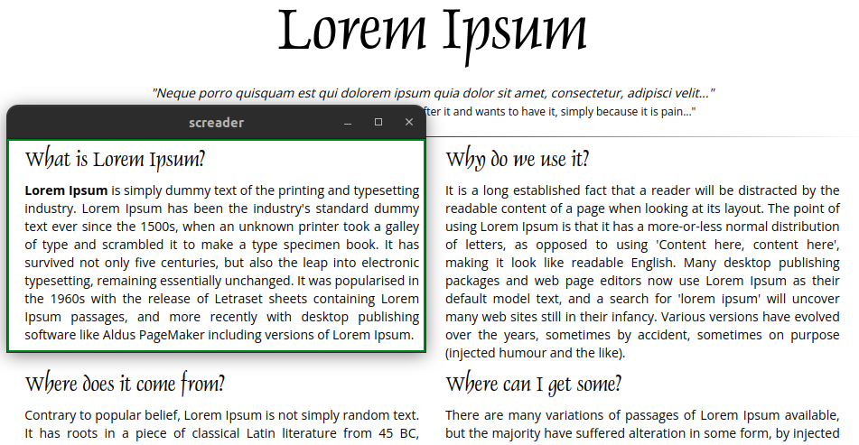
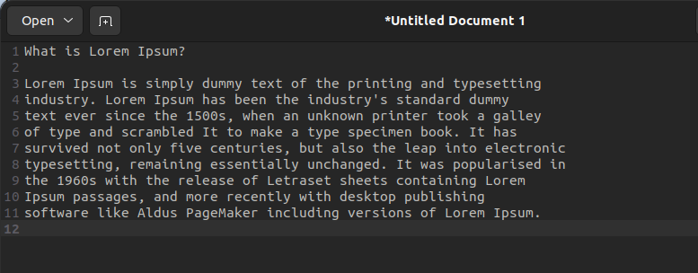

# screader
- Simple utility that converts screen areas to text, and then saves to your clipboard, ready for pasting. 
- Useful in workflows where you can't select the text like on images or proprietary interfaces/windows.

## usage
1. Go to [Releases](https://github.com/natzcam/screader/releases) and download zip.
2. Unzip and call `./screader`
3. Adjust window to where you want to capture text.

4. Minimize the window to trigger text recognition and saving to clipboard.

